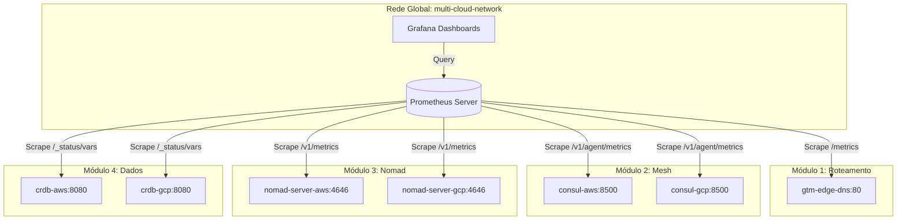

# 📊 Diretrizes e Arquitetura de Observabilidade Global

Este documento detalha o funcionamento da arquitetura de monitoramento centralizada e define as **diretrizes obrigatórias** para que toda infraestrutura e aplicação desenvolvidas no repositório estejam alinhadas ao princípio de **Observabilidade Ativa**.

---

## 🏛️ 1. Arquitetura de Coleta de Métricas

Toda a infraestrutura de laboratório do curso é interligada em uma rede Docker unificada chamada `multi-cloud-network`. O servidor central do **Prometheus** coleta de forma síncrona as métricas geradas por cada componente através de raspagem (*scraping*) contínua.

---

## 🔌 2. Mapeamento de Endpoints por Módulo

Para que o Prometheus consiga raspar as métricas com sucesso, cada serviço deve expor sua telemetria conforme a tabela abaixo:

| Módulo | Componente | Porta Interna | Rota de Métricas | Formato / Protocolo |
| :--- | :--- | :--- | :--- | :--- |
| **Módulo 1** | HAProxy (GTM) | `80` | `/metrics` | Prometheus nativo |
| **Módulo 2** | Consul Server | `8500` | `/v1/agent/metrics?format=prometheus` | Prometheus format |
| **Módulo 3** | Nomad Server | `4646` | `/v1/metrics?format=prometheus` | Prometheus format |
| **Módulo 4** | CockroachDB | `8080` | `/_status/vars` | Prometheus nativo |

---

## 📐 3. Diretrizes de Desenvolvimento Orientado a Observabilidade

Ao criar novos serviços, jobs do Nomad ou scripts Terraform, você deve seguir obrigatoriamente as seguintes diretrizes:

### A. Instrumentação de Aplicações (Padrão ouro)
Toda aplicação web mockada ou real criada para demonstração de resiliência deve expor um endpoint `/metrics` na porta HTTP principal utilizando bibliotecas cliente padrão do Prometheus (ex: `prom-client` para Node.js ou `prometheus/client_golang` para Go).

### B. Padronização de Labels (Rotulação Semântica)
Para garantir correlação entre painéis ativo-ativo, todas as métricas customizadas ou de infraestrutura devem incluir as seguintes labels (rótulos):
* `cloud`: Provedor de nuvem simulado (`aws`, `gcp`, `azure` ou `on-prem`).
* `region`: Região de deploy geográfica (`us-east-1`, `us-west-2`, etc).
* `env`: Ambiente de execução (`sandbox`, `staging`, `production`).

### C. Estrutura de Dashboards no Grafana (O Método RED)
Os painéis do Grafana criados para os módulos devem ser baseados no método **RED** para monitoramento de serviços:
1. **Rate (Taxa):** Número de requisições por segundo recebidas pelo componente (ex: `haproxy_frontend_http_requests_total`).
2. **Errors (Erros):** Taxa de requisições que resultam em falha (ex: HTTP status 5xx).
3. **Duration (Duração):** Tempo que as requisições levam para ser respondidas (latência por percentil: p50, p95, p99).

---

## 🔍 4. Como Validar e Diagnosticar

### Passo 1: Verificar se o Prometheus está coletando
Acesse o console do Prometheus em `http://localhost:9090/targets`. Todos os alvos mapeados que estiverem com containers ativos devem constar com o status **UP** (verde).

### Passo 2: Testar Queries de Integridade
No campo de busca do Prometheus, você pode validar o quórum distribuído usando queries PromQL como:
* **Status do Consul WAN Join:** `consul_wan_members`
* **Nós ativos do CockroachDB:** `cockroach_capacity_nodes`
* **Jobs rodando no Nomad:** `nomad_client_allocations_running`
