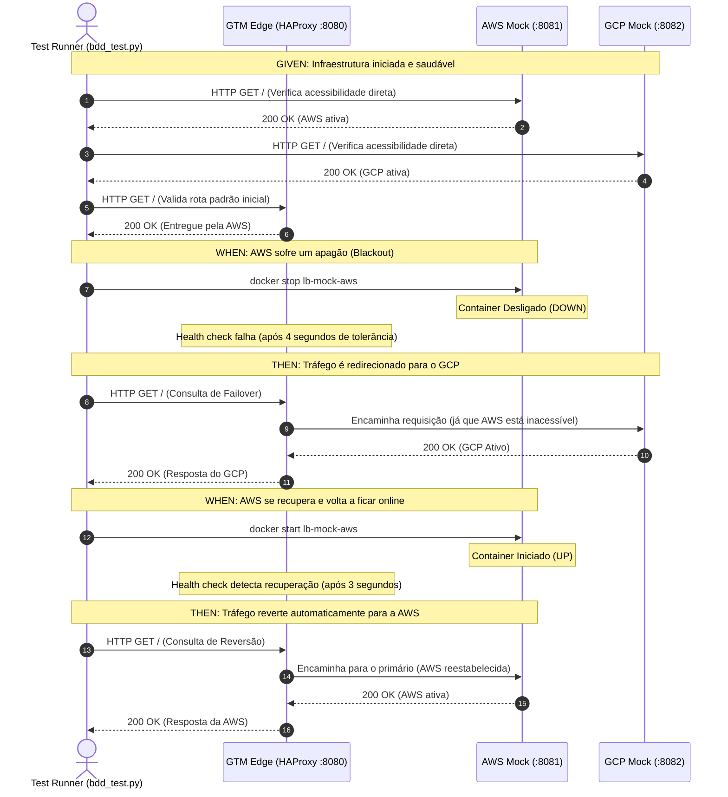
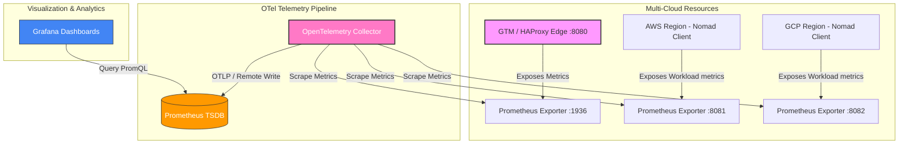

# 📊 Relatório do Cenário de Teste BDD

Este documento ilustra e detalha o fluxo de execução do teste de integração BDD (`bdd_test.py`) para validação do roteamento dinâmico e failover ativo-ativo.

## 🗺️ Diagrama do Fluxo de Teste (BDD Sequence)

O diagrama abaixo descreve a interação entre o Executor do Teste (`bdd_test.py`), o Global Traffic Manager (`HAProxy`) e os clusters regionais (`AWS` e `GCP`) em cada etapa do cenário BDD:

---

## 🔍 Detalhes dos Passos BDD

| Passo BDD | Ação Executada | Critério de Aceitação / Validação | Status |
| :--- | :--- | :--- | :--- |
| **GIVEN** | Verifica conectividade direta com as portas `:8081` (AWS) e `:8082` (GCP) | Ambas as portas devem retornar `HTTP 200` | **PASS** |
| **WHEN** | Executa o comando `docker stop lb-mock-aws` | O container AWS é desligado | **PASS** |
| **THEN** | Envia requisição HTTP para a porta global `:8080` | O retorno deve conter a assinatura de **GCP** | **PASS** |
| **WHEN** | Executa o comando `docker start lb-mock-aws` | O container AWS é reiniciado | **PASS** |
| **THEN** | Envia requisição HTTP para a porta global `:8080` | O retorno deve reverter para a assinatura de **AWS** | **PASS** |

---

## 📡 Arquitetura de Telemetria (Padrões OpenTelemetry - OTel)

Seguindo as melhores práticas de observabilidade moderna e padronização do **OpenTelemetry (OTel)**, o fluxo de coleta e entrega de métricas da PoC é estruturado de forma desacoplada através de coletores e agentes dedicados:

### Componentes do Pipeline OTel:
1. **Instrumentação / Exporters**: Cada componente do sistema (GTM/HAProxy e os workloads nos Nomad Clients) expõe suas métricas de forma nativa e padronizada.
2. **OTel Collector**: Centraliza a coleta (*scraping*) de métricas do HAProxy e de toda a infraestrutura, eliminando a dependência de múltiplos agentes específicos e unificando o tráfego de dados telemétricos.
3. **Prometheus TSDB**: Funciona como o banco de dados temporal de destino das métricas, populado através do pipeline de exportação do OTel Collector.
4. **Grafana**: A camada visual que lê os dados históricos do Prometheus para exibir gráficos consolidados de RPS e status do cluster.

