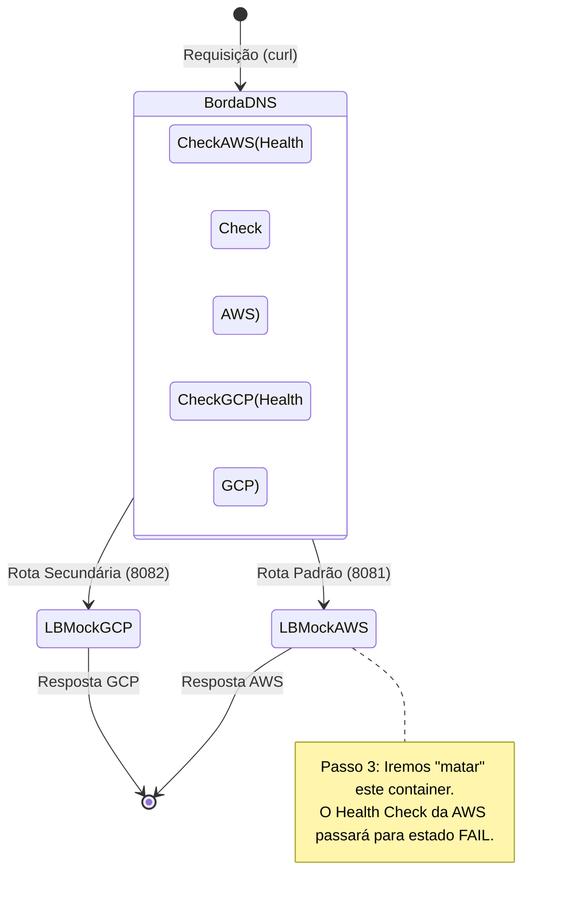

# Laboratório: Global Traffic Manager (Roteamento Ativo-Ativo)

Neste laboratório, você verá como o DNS reage dinamicamente a falhas de infraestrutura, desviando o tráfego de usuários antes mesmo que eles percebam o erro.

## Fluxo da Prova de Conceito (PoC)



## Objetivos
1. Levantar dois servidores Web independentes simulando AWS e GCP.
2. Injetar tráfego balanceado entre eles.
3. Derrubar a nuvem "Primária" (AWS) e verificar o comportamento do sistema.

---

## Passo 1: Preparação (Acionando o Agente)
Você não precisa escrever o Terraform do zero. Invoque o Agente de IA com o seguinte prompt:
> *"Agente, ative a SKILL Global Traffic Manager e suba a PoC local de Load Balancers simulados para o Módulo 1."*

O agente vai gerar e aplicar um código (via Docker ou Terraform) que colocará dois Load Balancers nas portas `8081` (Mock AWS) e `8082` (Mock GCP).

## Passo 2: Verificação do Tráfego "Feliz"
No seu terminal, rode um loop simples para simular usuários acessando seu sistema:
```bash
for i in {1..10}; do curl -s http://localhost:8081 || curl -s http://localhost:8082; sleep 1; done
```
*Nota: Como estamos simulando o roteamento global localmente, este script representa a inteligência da "Borda" tentando o primeiro endpoint e caindo para o segundo em caso de falha.*

## Passo 3: O Desastre (Simulando a Queda da AWS)
Agora, vamos matar o Data Center da AWS. Se você estiver usando o Docker Mock fornecido pelo Agente:
```bash
docker stop lb-mock-aws
```

## Passo 4: Observando o Auto-Failover
Execute novamente o loop do Passo 2. Você verá que o script falhará quase imperceptivelmente no 8081, mas a requisição será automaticamente entregue com a resposta do `lb-mock-gcp`.

**Conclusão**: O usuário final não sofreu indisponibilidade total, provando o valor do roteamento Ativo-Ativo e Global Health Checks.
