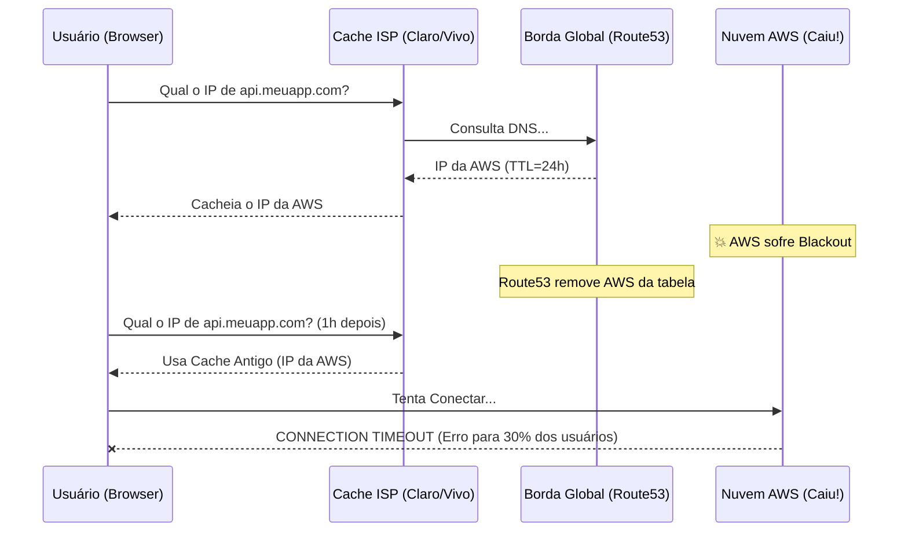

# Troubleshooting: Global DNS e Roteamento

Nesta seção, abordamos os problemas mais comuns encontrados ao implementar roteamento Multi-Cloud Ativo-Ativo na vida real (usando Route53, Cloudflare, etc).

## 1. Split-Brain DNS (Caching Maldito)

**Problema**: A nuvem AWS caiu. O Health Check global detectou a falha, removeu a AWS da tabela de DNS, mas 30% dos seus usuários continuam recebendo mensagens de erro.
**Causa**: O **TTL (Time to Live)** do seu registro DNS está muito alto (ex: 86400 segundos / 24 horas). Provedores de internet (ISPs) ao redor do mundo armazenam o IP antigo em cache e não consultam a atualização de borda.
**Solução**: Em arquiteturas Ativo-Ativo críticas, o TTL do registro (A/CNAME) no Apex Domain deve ser baixíssimo (ex: `60 segundos`).

## 2. Flapping (Efeito Sanfona)
**Problema**: O roteamento fica mudando a cada 10 segundos entre AWS e GCP, causando falhas intermitentes.
**Causa**: Seu Health Check está configurado de forma muito agressiva (ex: tenta pingar a cada 1 segundo e reprova se demorar 2s). Uma simples lentidão na internet causa um falso positivo de "Nuvem Morta".
**Solução**: Configure limites de tolerância sensatos.
* `Request Interval`: 10 a 30 segundos.
* `Failure Threshold`: Mínimo de 3 falhas consecutivas antes de desviar o tráfego.

## 3. Latency-Based Routing Enviando para a Nuvem Errada
**Problema**: Usuários no Brasil estão sendo roteados para o Data Center da AWS em Tokyo.
**Causa**: O tráfego Anycast e roteamento por latência depende da tabela BGP global. As vezes rotas submarinas são alteradas por provedores locais, tornando o caminho para Tokyo temporariamente "mais rápido" em saltos do que para a Virginia.
**Solução**: Combine *Latency-Based* com *GeoDNS* (Roteamento Geográfico) forçando que IPs da América do Sul nunca sejam roteados para a Ásia.
