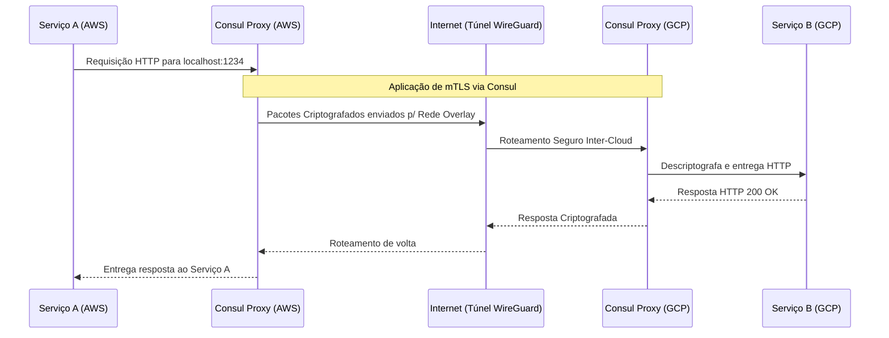

# Módulo 2: Conectividade, ACLs e RPC Inter-Cloud

Após garantir que a borda redireciona os usuários corretamente (Módulo 1), o próximo desafio de uma arquitetura Multi-Cloud é a **comunicação interna (Backend to Backend)**.

Se um microsserviço rodando na AWS precisar consultar um microsserviço no GCP, como fazemos isso de forma segura?

## O Problema
A solução ingênua é expor as APIs de todos os microsserviços na internet pública e protegê-las com senhas. Isso abre portas para vazamentos catastróficos e ataques DDoS diretamente nos seus dados. Além disso, as redes das nuvens (VPCs) são isoladas por padrão. O IP `10.0.0.5` na AWS não sabe como chegar no IP `10.0.0.8` no GCP.

## Mapa de Arquitetura

## A Solução: VPNs Mesh e Service Discovery

Nós resolvemos isso empilhando duas tecnologias:

1. **Camada L3 (Infraestrutura) - WireGuard**: O WireGuard é um protocolo de VPN extremamente leve e rápido incorporado diretamente no kernel do Linux. Usamos ele para criar um túnel (rede Overlay) entre as VPCs da AWS e do GCP. Ele criptografa todo o tráfego que sai de uma nuvem em direção a outra.
2. **Camada L7 (Aplicação) - Consul Federation**: O Consul, também da HashiCorp, atua como um catálogo vivo (Service Discovery) de todas as aplicações. Quando unimos (federamos) o Consul da AWS com o Consul do GCP através do túnel WireGuard, ele aplica uma malha de serviços (*Service Mesh*).
   * Ele usa **mTLS (Mutual TLS)**: Toda requisição entre serviços é criptografada e autenticada matematicamente através de certificados gerados automaticamente. A API da AWS não aceita conexões do GCP se o certificado for inválido.

## Exercício Prático (PoC)

O Agente criará dois containers locais simulando as nuvens e estabelecerá uma comunicação criptografada.

**Passo 1**: Acione o Agente para executar a `[SKILL: Mesh Interconnect]`.
*(Diga ao Agente: "Por favor, provisione a PoC do Módulo 2 usando a Mesh Interconnect")*

**Passo 2**: O Agente informará que o Consul da "Região 1" está agora ciente dos serviços rodando na "Região 2".

**Passo 3**: Verifique no terminal que a comunicação só ocorre via porta segura e não expõe tráfego em texto limpo.
