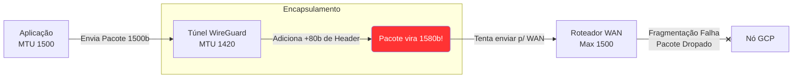

# Troubleshooting: Mesh Network Inter-Cloud

Erros comuns ao tentar unir redes de provedores diferentes via WireGuard e Consul Federation.

## 1. Falha no WAN Join (Split-Brain de Consul)
**Problema**: O comando `consul members -wan` só lista o Data Center local. Os serviços da AWS não encontram os serviços do GCP.
**Causa**: Bloqueio de Firewall. O Consul precisa de comunicação bidirecional na porta `8302` (TCP/UDP) para Gossip de WAN.
**Solução**: Verifique as regras de *Security Groups* na AWS e regras de Firewall da VPC no GCP. Lembre-se de liberar tanto TCP quanto UDP, pois o Consul usa UDP para checagem rápida de saúde (Gossip) e TCP para transferência de estado.

## 2. Erro de Certificado mTLS (Handshake Failed)
**Problema**: O túnel existe, o DNS do Consul resolve, mas o Serviço A recebe `503 Service Unavailable` ou `TLS Handshake Error` ao tentar chamar o Serviço B.
**Causa**: Cada Data Center do Consul está usando uma Root CA (Autoridade Certificadora) diferente. Para a Federação funcionar, ambos os Data Centers precisam confiar na mesma Root CA.
**Solução**:
1. Exporte a CA do Data Center Primário: `consul tls ca read > ca.pem`.
2. Importe no Data Center Secundário durante o bootstrap.

## 3. Sobrecarga no Túnel WireGuard (MTU Mismatch)

**Problema**: Conexões simples (ping, requisições pequenas) passam de uma nuvem para outra. Requisições pesadas (transferência de arquivos grandes, payloads JSON gigantes) caem com *Timeout*.
**Causa**: O MTU (Maximum Transmission Unit) do WireGuard geralmente é configurado para `1420`. A aplicação tenta enviar `1500` bytes, o WireGuard adiciona seu cabeçalho criptográfico, e o pacote excede o limite físico das placas de rede, sendo derrubado.
**Solução**: Configure explicitamente as interfaces de rede (`wg0`) em ambos os lados para um MTU seguro (ex: `1360` ou `1420`) e aplique o *TCP MSS Clamping* usando o `iptables`.
