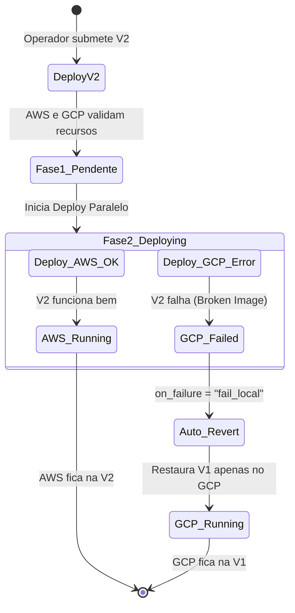

# Laboratório: Federação Nomad e Multi-Region Jobs

Neste laboratório, nós não usaremos o cluster Raft único devido às exigências de baixa latência explicadas no Módulo. Criaremos dois agrupamentos distintos e os federaremos, observando o rollout da aplicação.

## Fluxo do Laboratório (Auto-Revert)



## Objetivos
1. Levantar o painel de controle do Nomad na AWS (Server Raft isolado).
2. Levantar o painel de controle do Nomad no GCP (Server Raft isolado).
3. Submeter um `.nomad` Job Specification que faz o deploy para ambos.

---

## Passo 1: O "Cérebro" Dividido (Acionando o Agente)
Invoque o Agente:
> *"Agente, execute a SKILL Nomad Federation Builder. Provisione os Nomad Servers simulando os data centers us-east (AWS) e us-west (GCP)."*

O Agente criará dois control-planes. Cada um pensa ser o líder de seu próprio domínio, mas ambos estão cientes do outro graças ao RPC.

**Dica Prática:** Você também pode usar o `Makefile` incluído para executar os testes automaticamente:
```bash
make test
```

## Passo 2: O Deploy Global
Peça ao Agente:
> *"Agente, gere um arquivo Job Specification baseado na SKILL Multi-Region Job Operator, rodando 2 containers Nginx. Em seguida, submeta no Nomad."*

## Passo 3: Observação do Auto-Rollback
Para ver a resiliência pura do Nomad Enterprise em ação, abra o HCL gerado no Passo 2 e altere apenas o bloco `region "us-west"`, forçando a imagem Docker para `nginx:broken-image` (uma imagem que não existe).
Reaplique o job.

Você notará que:
1. A AWS (`us-east`) continuará rodando a aplicação original intacta.
2. O GCP (`us-west`) falhará ao baixar a imagem. O Nomad identificará a falha local (`on_failure = "fail_local"`) e executará o `auto_revert` devolvendo os containers antigos do GCP ao ar.
3. Não haverá falha catastrófica geral no sistema.