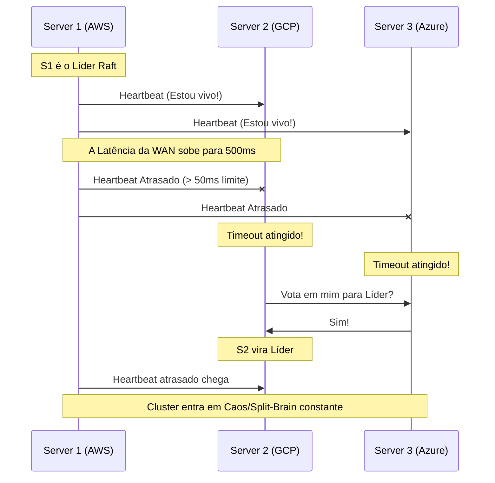

# Troubleshooting: HashiCorp Nomad em Multi-Cloud

Problemas operacionais clássicos na orquestração de cargas multi-região.

## 1. Timeout na Eleição do Raft (Sem Líder)

**Problema**: O comando `nomad server members` mostra os nós, mas o cluster se recusa a aceitar novos Jobs. Os logs gritam `no cluster leader`.
**Causa**: Latência excessiva, ou partições de rede, em um cluster Nomad único espalhado geograficamente. Se o heartbeat entre os Servers atrasar devido à latência física (velocidade da luz entre continentes), o Raft declara a perda do líder prematuramente e paralisa tudo em um loop de re-eleição.
**Solução**: Refaça o design para **Federated Clusters** (Múltiplos clusters autônomos por região). Se você deve ter apenas um cluster esticado (Single Cluster), ajuste os parâmetros de `performance` (ex: `raft_multiplier = 5`) no `server.hcl`, mas saiba que a estabilidade não é garantida sobre a WAN.

## 2. Erro "No nodes were eligible for evaluation"
**Problema**: Você submete o job, ele fica no status `pending` eternamente e nunca roda.
**Causa**: O scheduler do Nomad não encontrou nenhuma máquina Client que satisfaça suas restrições (Constraints).
**Solução**: Verifique o seguinte:
* As opções `datacenters` e `region` no seu Job batem exatamente com as configurações dos seus Clients?
* Suas tarefas (Tasks) estão pedindo 5000 MHz de CPU, mas seus nós Client têm apenas 2000 MHz livres? O Nomad nunca colocará um job em um nó sem recursos garantidos.

## 3. Two-Phase Submission Falhando Silenciosamente
**Problema**: Você tenta fazer deploy de um arquivo `multiregion`, a AWS recebe, mas a GCP não.
**Causa**: Replicação de ACLs atrasada ou RPC bloqueado. Em um deploy multi-region, o Nomad Server primário envia a fase 1 para o secundário via porta RPC `4648`.
**Solução**: Verifique o status da replicação: `nomad acl policy list`. Certifique-se de que o Security Group na AWS permite tráfego na porta 4648 partindo do bloco IP da VPC do GCP.