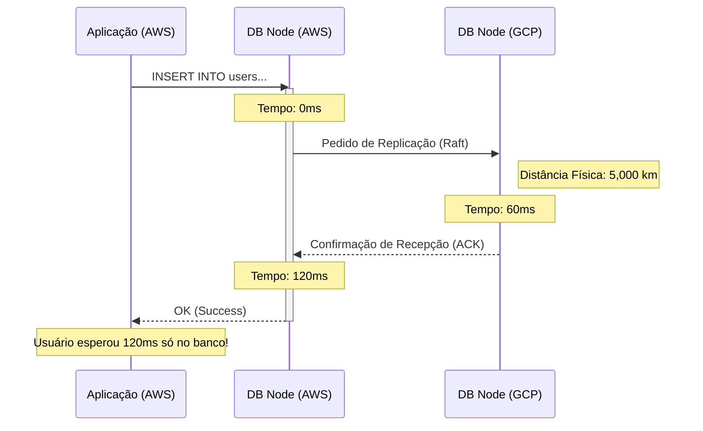

# Troubleshooting: Dados Distribuídos e Teorema CAP

Problemas que farão seu banco multi-cloud NewSQL quebrar na vida real.

## 1. O Cluster Perdeu a Maioria (Stale Data / Downtime)
**Problema**: Você derrubou a AWS. O cluster CockroachDB deveria fazer o failover para o GCP. Em vez disso, todas as transações começaram a retornar erro ou ficar paralisadas, e o painel acusa "Under-replicated ranges".
**Causa**: Você desenhou uma topologia com número *par* de regiões (apenas AWS e GCP) e com regras rigorosas de Consistência Forte (CP no Teorema CAP). Sem um 3º nó ou nuvem (o Witness) para desempatar, o banco GCP se recusa a aceitar novos dados para não gerar *Split-Brain*.
**Solução**: SEMPRE utilize número ímpar (3, 5, 7) de datacenters quando for fazer quorum de sobrevivência a desastres de região inteira. Zonas baratas na Azure (Witness) são perfeitas para isso.

## 2. Relógios Dessincronizados (Time Drift)
**Problema**: O CockroachDB (ou Cassandra, Spanner) recusa a inicializar ou sofre *crashes* contínuos acusando `clock sync error` ou `drift exceeded`.
**Causa**: Bancos de dados distribuídos dependem brutalmente do relógio da máquina (NTP) para ordenar os logs de transação concorrente sem usar um relógio centralizado. Se a AWS estiver 500ms fora do horário oficial e o GCP estiver cravado no horário oficial, o banco enlouquece.
**Solução**: Instale e ative *Chrony* (NTP client de alta precisão) ou utilize soluções de Time Sync da própria cloud (como AWS Time Sync Service) em todas as máquinas e force a tolerância máxima (ex: `--max-offset=500ms`).

## 3. Alta Latência na Escrita (Write Pinhole)

**Problema**: Requisições de SELECT (leitura) são em torno de 1ms, mas todo `INSERT` ou `UPDATE` leva 120ms, tornando a aplicação inviável.
**Causa**: O seu líder do *Range* de dados está na AWS, mas as réplicas estão no GCP (latência de ida e volta de ~120ms). Para o `INSERT` ser confirmado, o protocolo exige que o Quorum físico responda.
**Solução**: Use recursos como *Regional Tables* (onde dados de clientes do Brasil só moram no Data Center do Brasil) ou configure *Locality* e *Survival Goals* precisos para sacrificar um pouco da tolerância à falha global em favor do ganho de performance local.