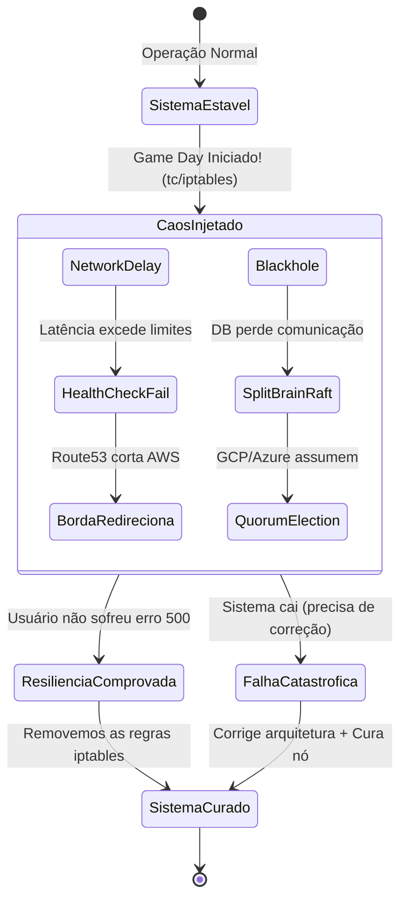

# Laboratório Final: Chaos Engineering "Game Day"

Neste laboratório nós não subiremos serviços novos; em vez disso, vamos **quebrar de propósito** a comunicação de rede das instâncias das nuvens (simuladas em PoC) usando ferramentas de manipulação de Kernel do Linux (`tc` e `iptables`).

## O Ciclo da Engenharia do Caos



## Objetivos
1. Observar os sintomas de uma rede inter-cloud sofrendo "Packet Loss" massivo.
2. Comprovar a resiliência via Timeout de Health Checks e Auto-Reverts do Nomad e DNS.
3. Simulando um "Black Hole" (Toda a comunicação engolida).

---

## Passo 1: O Disparo da Arma (Acionando o Agente)
Abra pelo menos duas sessões de terminal rodando testes de PING, ou os loops de requisição aos bancos ou Load Balancers.

Invoque o Agente de IA:
> *"Agente, assuma sua SKILL de Chaos Simulator. Por favor, acione o atraso de rede (delay e packet loss) no meu nó AWS."*

O agente vai gerar e executar comandos do `tc qdisc` para destruir a performance de rede dentro do ambiente simulado.

**Dica Prática:** Você também pode usar o `Makefile` incluído para executar os testes automaticamente:
```bash
make test
```

## Passo 2: Cascading Failures
Observe o que ocorre: as conexões entre o Nomad Server AWS e GCP começarão a engasgar, emitindo alertas de que o RPC está demorando. Os Health Checks começarão a falhar e o banco CockroachDB acusará instabilidade no Raft.

O roteamento da sua Borda (Module 1) deverá agir imediatamente, isolando a AWS.

## Passo 3: O Black Hole
Peça ao agente:
> *"Agente, injete a regra de Blackhole via Iptables (DROP) no nó AWS."*

Isso irá "queimar" virtualmente a máquina. O nó AWS continuará de pé e achando que está vivo, mas **ninguém de fora conseguirá falar com ele, nem ele com o mundo**. O sistema GCP / Azure assumirá a carga integral.

## Passo 4: A Cura
Nunca deixe o caos sem reverter! Peça ao Agente:
> *"Agente, cure o nó AWS removendo as regras de tc e iptables."*

Você observará (lendo os logs) que o nó AWS acordará atordoado, reconectará no cluster Gossip (Consul), sincronizará os logs de estado recentes (Cockroach/Nomad) que ele perdeu durante seu isolamento e voltará ao normal!