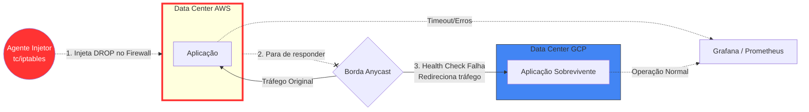

# Módulo 5: Caos, Resiliência e Cascading Failures

Até aqui você construiu DNS Roteáveis Globais, túneis criptografados por Consul, gerenciou orquestração multi-datacenter com Nomad e sobreviveu à latência usando bancos NewSQL distribuídos.

Mas sua arquitetura só sobrevive ao desastre no papel. A única forma de comprovar que as configurações de `failover`, `auto_revert` e quorum `Raft` funcionam é quebrando elas em tempo real. Isso é a **Engenharia do Caos**.

## O "Game Day" da Infraestrutura

O *Game Day* é uma prática onde os engenheiros se reúnem e ativamente injetam falhas catastróficas na infraestrutura em produção.

O que pode dar errado?
1. **Network Partition (Blackhole)**: Uma nuvem fica perfeitamente online, porém, o link de comunicação com a outra nuvem se rompe, simulando o corte de cabos submarinos.
2. **Cascading Failures (Sobrecarga)**: Se a AWS cair, os roteadores enviarão 100% dos seus usuários subitamente para o GCP. Se as VMs do GCP não conseguirem suportar ou escalar, o GCP também cairá.

## Mapa de Arquitetura do Game Day

## Como testamos isso?
Em vez de desligar VMs, manipularemos diretamente a pilha de rede do Linux para causar condições precárias na transmissão de dados e observar como os sistemas (Consul, Nomad, CockroachDB) tentam curar a própria arquitetura.

## Exercício Prático (PoC Final)

Usaremos a SKILL do Agente chamada `[SKILL: Chaos Simulator]`. Ela não usa Terraform, e sim ferramentas nativas do Kernel Linux (como `tc` - Traffic Control, e `iptables`).

**Passo 1**: Acione o Agente: "Inicie o Chaos Simulator no Data Center AWS."

**Passo 2**: O Agente primeiro adicionará 500ms de atraso nos pacotes de rede (usando a ferramenta `tc qdisc netem delay 500ms`). Isso fará com que aplicações da nuvem AWS estourem seus tempos limite (Timeout) tentando falar com o banco de dados.

**Passo 3**: Observe como o Consul e o DNS na Borda identificam esse retardo e tiram os nós da AWS da rotação *antes mesmo deles pararem*.

**Passo 4**: O Agente aplicará um bloqueio total de portas simulando que a AWS queimou (DROP no `iptables`). O Nomad acionará o `fail_local` ou um fallback e você, através de Dashboards, provará que nenhum usuário sentiu impacto e os dados estão salvos no GCP e Azure.